# Автоматизация обучения с использованием GitHub

[](https://creativecommons.org/licenses/by-nc-nd/4.0/)

## Зачем нужна автоматизация приема заданий?

Когда идет речь про обучение разработчиков – самое ценное, это feedback, который преподаватель дает студентам по итогам
выполненного задания. Но когда в вашей группе 50+ человек и 5+ лабораторных работ, работать с каждым даже по 20 минут (а
именно столько обычно занимает прием одной лабораторной) становится слишком затратно.

Но делать это безусловно нужно.

Прием лабораторной обычно делится на две части:

* проверка корректности выполнения задания;
* обсуждение как она была реализована и собственно сам feedback по этому решению.

И вот первый пункт как раз хотелось бы автоматизировать, потому что на него тратится минимум 50% времени приема. Плюс,
иногда у меня была ситуация, когда я чувствовал, что студент сделал лабораторную неправильно, но не мог понять где у
него ошибка в реализации.

Обычно такая ситуация происходила из-за того, что студент:

* недопонял задание и сделал что-то другое;
* неправильно понял реализацию.

Как бы ни было хорошо описано задание, все равно найдется кто-то, кто сделает не то что нужно. Тут, несомненно,
ответственность преподавателя, но если задание уровня `Hello, World` описать во всех подробностях на 5 страниц, читать
его никто не будет. Соответственно задание нужно формулировать кратно и четко описывать требования.

Я в своих лабораторных придерживаюсь такого шаблона:

```markdown
# Название

## Формулировка

Краткое описание проблематики и что нужно сделать.

### Требования

Подробно по пунктам, что нужно сделать, какие технологии использовать и какие есть _ограничения_.

### Пояснения

В этом пункте стараемся подробно описать нюансы реализации, как и для чего использовать конкретные технологии (если
применимо).

Это самый важный пункт, т.к. в нем мы стараемся предусмотреть _все_ возникающие в процессе реализации у студента вопросы
и дать на них ответы или ссылки на материалы.

### Прием задания

Описание шагов, как запустить и проверить корректность выполнения задания. Например, если у нас Java приложение,
то `./gradlew clean test`.

## Литература

Ссылки на статьи, которые помогут выполнить лабораторную работу.
```

Вот примеры описания [homework1](https://github.com/Romanow-Education/homework1-template),
[homework2](https://github.com/Romanow-Education/homework2-template).

## Как будем делать автоматизацию?

Помимо описания требований, еще очень полезно описывать критерии приема, понятные всем – **тесты**. Если тесты прошли –
ваша реализация рабочая, если нет – вот исходники, разбирайтесь. Этот подход очень близкий к реальной работе, т.к. если
вы что-то исправили и тесты сломались – ответственность за их исправлении лежит на вас.

Мы не будем разбирать критерии полноты тестов для оценки правильности выполнения лабораторной: это очень большая и
сложная тема, требующая отдельного разговора.

Поговорим про то, как нам с помощью тестов проверить автоматизировать проверку правильности выполнения лабораторных.

### Автоматизация через GitHub Actions

Для работы со студентами я использую GitHub как публично доступный инструмент + репозитории на GitHub – это портфолио
для разработчиков.

В [2019](https://github.blog/2019-08-08-github-actions-now-supports-ci-cd/)
году [Github Actions](https://docs.github.com/en/actions/learn-github-actions/understanding-github-actions) стали
публично доступными и _бесплатными_ для публичных репозиториев.

Соответственно, мы создаем репозиторий и в нем описываем шаги CI/CD. Если сборка проходит успешно – это _необходимое_
условие приема лабораторной.

[classroom.yml](https://github.com/Romanow-Education/homework1-template/blob/master/.github/workflows/classroom.yml)

```yaml
name: Build project
on:
  push:
    branches: [ master ]
jobs:
  build:
    name: Autograding
    runs-on: ubuntu-latest
    steps:
      - uses: actions/checkout@v2
      - uses: actions/setup-java@v1
        with:
          java-version: 11
      - uses: eskatos/gradle-command-action@v1
        with:
          arguments: clean build
      - name: Test Report
        uses: mikepenz/action-junit-report@v2
        if: always()
        with:
          report_paths: '**/build/test-results/test/TEST-*.xml'
```

Успешная сборка – лишь _необходимое_ условие приема лабораторных, а _достаточным_ условием все равно остается очное
общение со студентом и обсуждение его реализации.

### Прием через Fork + Pull Request

Идем дальше: мы создали репозиторий, описание задание, теперь нужно это выдать студентам и потом собрать результат.

Самый простой способ работы – это `Fork` репозитория и `Pull Request` по окончанию выполнения. Вариант простой и
удобный, более того, вы можете в `Pull Request` писать feedback.

Но здесь есть две проблемы:

* `Pull Request` виден всем студентам, а значит сложно сдержаться от _просмотра чужих решений_;
* в `Pull Request` не доступны ваши `Secrets`, а значит все токены и т.п. нужно прописывать в явном виде.

### GitHub Classroom

GitHub активно поддерживает обучение молодых разработчиков: у них образовательные курсы по Git и GitHub, они
предоставляют [Student Developers Pack](https://education.github.com/pack): набор программ и решений, бесплатных на
время обучения. А самое главное, у них есть своя платформа для автоматизации приема
лабораторных: [GitHub Classroom](https://classroom.github.com/).

Из больших плюсов этого решения: здесь есть приватные репозитории и dashboard с агрегированной информацией по студентам.

Посмотрим как пользоваться этим решением. (в примерах используем
организацию [https://github.com/Romanow-Education/](https://github.com/Romanow-Education/))

1. Создаем организацию: `New Organization` -> `Romanow-Education`, `My Personal Account` -> `Next` -> `Complete Setup`.
   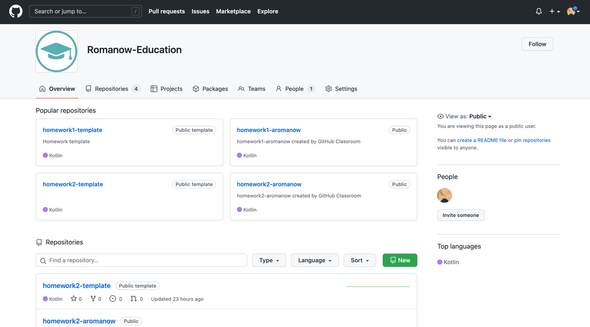
2. Создаем Classroom: `https://classroom.github.com/` -> `New Classroom` -> `demo-classroom` -> `Create Classroom`.
   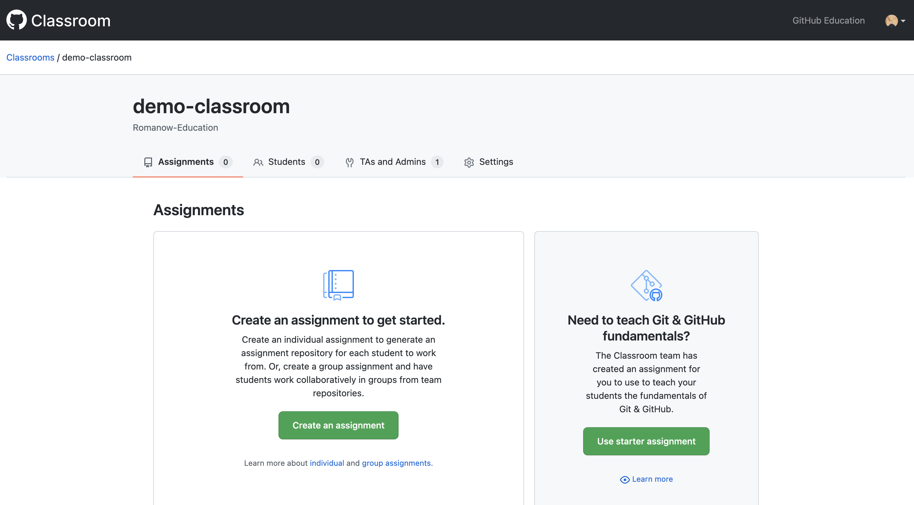
3. Создаем Template Repository с шаблоном проекта и заданием для нашей
   лабораторной: [homework1-template](https://github.com/Romanow-Education/homework1-template/). Важно в настройках
   репозитория указать что это template: `Settings` -> `General` -> `Template Repository`.
   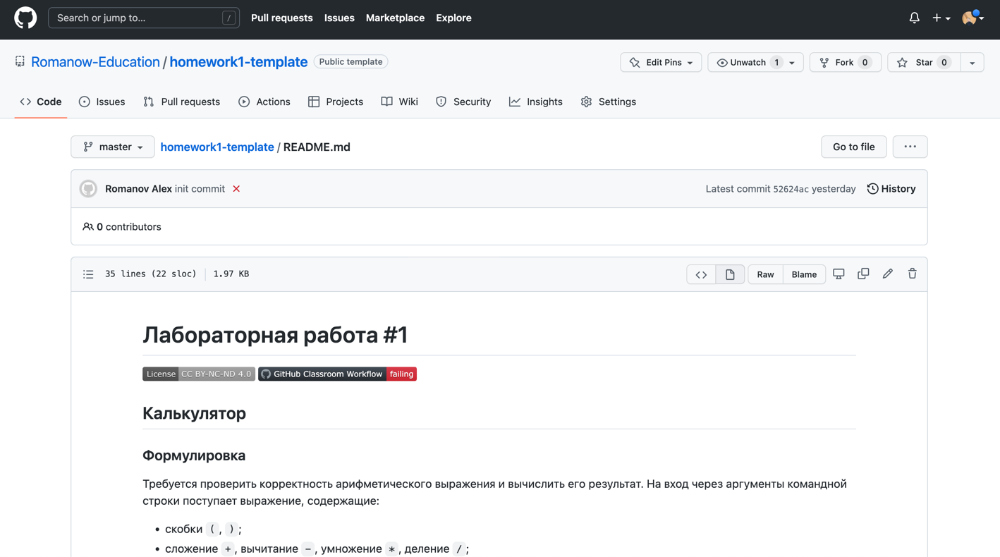
4. В Classroom создаем задание (assignment): `New Assignment` -> title: `Homework1`,
   `Grant students admin access to their repository` ->
   `Add a template repository to give students starter code`: `homework1-template` -> `Continue` -> `Create Assignment`.
   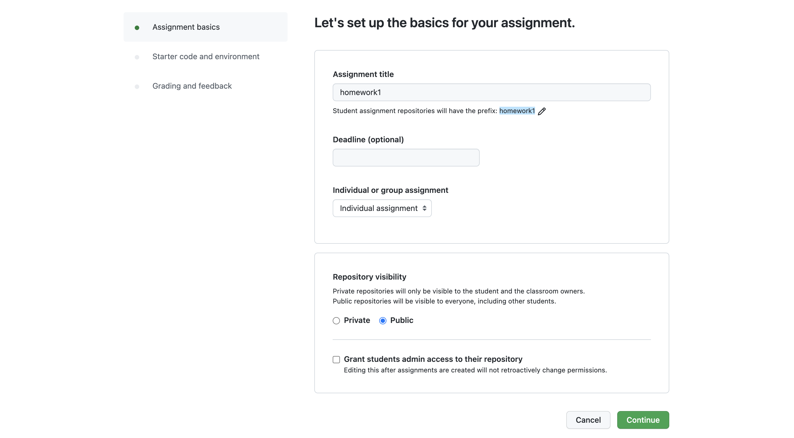
   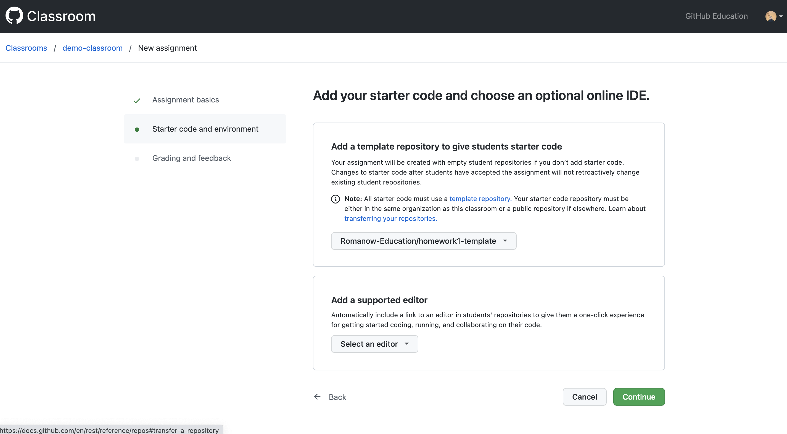
5. Для того чтобы сопоставить студентов с их репозиториями, нужно перед выдачей заданий в `Classroom` -> `Students`
   добавить список студентов.
6. В результате будет создана ссылка вида `https://classroom.github.com/a/test-test`, которую нужно выдать студентам.
   После того как студент перешел по ссылке, ему будет предложено выбрать свою фамилию имя из списка, а после на базе
   template создается репозиторий в организации и студент появляются в dashboard.
   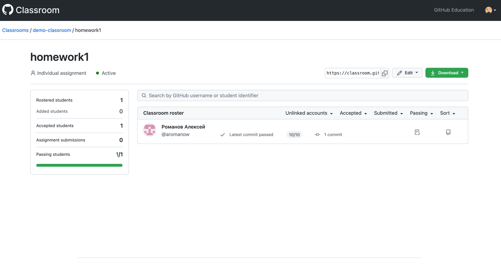

### Настройка Auto Grading

Итак, мы создали Organization и Classroom, описали шаги в GitHub Actions, как теперь сделать, чтобы при успешной сборке
в dashboard было отмечено успешное выполнение лабораторной?

Для этого в папке `./github/classroom/` создается
файл [autograding.json](https://github.com/Romanow-Education/homework1-template/blob/master/.github/classroom/)
следующего содержания:

```json
{
  "tests": [
    {
      "name": "Run tests",
      "setup": "",
      "run": "./gradlew clean test",
      "input": "",
      "output": "",
      "comparison": "included",
      "timeout": 10,
      "points": 10
    }
  ]
}
```

А в папке `./github/workflows` манифест сборки нужно переименовать
в [classroom.yml](https://github.com/Romanow-Education/homework1-template/blob/master/.github/workflows/classroom.yml) и
добавить там шаг:

```yaml
- uses: education/autograding@v1
```

Этот шаг будет запускать проверки, описанные в `autograding.json` и в случае успешного завершения, отмечать в dashboard.

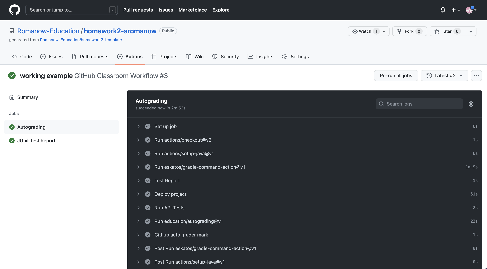

Если при прогоне тестов в шаге `education/autograding@v1` появляется ошибка:

```
Autograding failure: HttpError: Resource not accessible by integration
```

То в настройках Organization открыть `Settings` -> `Workflow permissions` -> установить `Read and write permissions`
(Workflows have read and write permissions in the repository for all scopes).

### Использование тестов для автоматизированной проверки

Если у нас Java приложение, то в `autograding.json` можно описать стандартную команду `./gradlew clean test`, а в самом
приложении описать unit и интеграционные тесты с
использованием [TestContainers](https://www.testcontainers.org/test_framework_integration/junit_5/).

Например, как в [homework1](https://github.com/Romanow-Education/homework1-template).

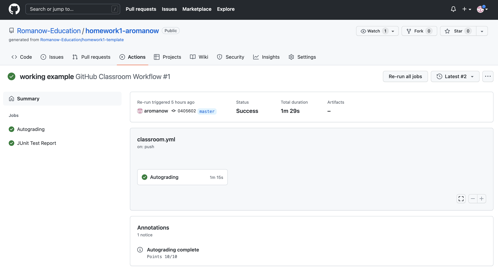

Но что делать, если язык реализации не задан или для проверки функциональности unit тестов недостаточно?

Для этого можно использовать [newman](https://www.npmjs.com/package/newman) – cli клиент для Postman, а тесты описывать
как end-to-end сценарии. Тут есть два нюанса:

* newman (postman) – это http клиент, соответственно, его можно использовать только для проверки web сервера;
* т.к. у нас web сервер, для проверки нужно его куда-то задеплоить (например
  на [Heroku](https://devcenter.heroku.com/articles/how-heroku-works)), а в newman указывать внешний url.

### Проблемы при использовании GitHub Classroom

Для _приватных_ репозиториев в организации время использования GitHub Actions не бесконечное, в бесплатном пакете
доступно 2000 минут в месяц, которых при активном использовании группой в 50 человек хватает на неделю.

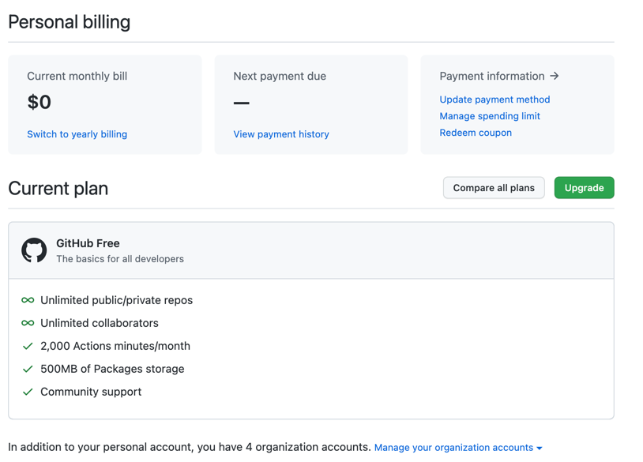

Дальше есть два варианта решения:

* [покупка платного аккаунта](https://github.com/pricing): 3000 минут за 4$/user в месяц или 50000 минут за 21$/user в
  месяц.
* [поминутная оплата](https://docs.github.com/en/billing/managing-billing-for-github-actions/about-billing-for-github-actions#per-minute-rates):
  0.008$/min на Linux runner;
* использование
  [self-hosted runner](https://docs.github.com/en/actions/hosting-your-own-runners/about-self-hosted-runners):
  можно просто развернуть свой runner на виртуальной машине в вашей компании, главное чтобы она была доступна из
  интернета.

Последний вариант самый удобный, более того, если вы знаете, что будете использовать его для конкретного языка и
технологий, то все необходимые зависимости можно сразу установить на виртуальную машину, тем самым пропуская шаг
установки и настройки зависимостей в actions.

Если же требуется получить обобщенный runner под разные языки и технологии, то можно с помощью packer
собрать [образ](https://github.com/actions/virtual-environments/tree/main/images/linux), который GitHub использует для
своих runner.

На каждый запуск action GitHub пересоздает runner, тем самым получая чистое окружение. Если использовать постоянный
self-hosted runner, то он со временем забьется мусором и его чистить или пересоздавать.

## Как вести учет лабораторных?

При работе с курсом студентов использование Classroom Dashboard не очень удобно, потому что там нет разбиения на группы
и нет сводной таблицы по всем лабораторным. Для ведения сводной таблицы я
использую [Google Sheet](https://docs.google.com/spreadsheets/d/1XbYbAtGO6dm4BQNDsFWmAQhdhdFOcUQakxpEJTaQI4Y/edit?usp=sharing)

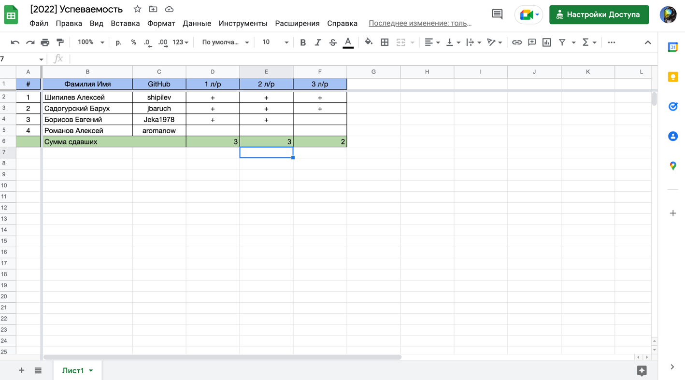

Переносить руками из Classroom Dashboard в Google Sheet очень неудобно, поэтому я написал
свой [github-auto-grader-mark action](https://github.com/marketplace/actions/github-auto-grader-mark), который по имени
пользователя, запустившего сборку, ищет нужную строчу в Google Sheet и ставит пометку об успешном выполнении.

Этот action идет после запуска `education/autograding@v1`:

```yaml
- name: Github auto grader mark
  uses: Romanow/google-sheet-autograder-marker@v1.0
  with:
    google_token: ${{secrets.GOOGLE_API_KEY}}
    sheet_id: "1XbYbAtGO6dm4BQNDsFWmAQhdhdFOcUQakxpEJTaQI4Y"
    homework_number: 2
    mark: "'+"
```

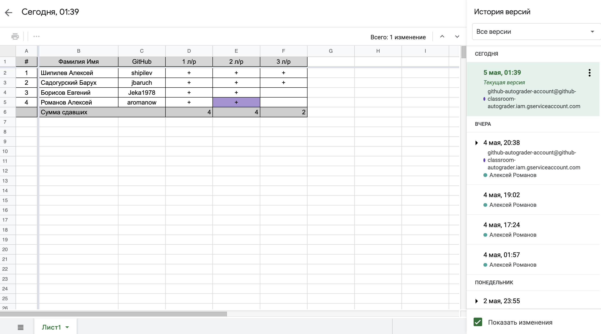

Взаимодействие выполняется Google Sheet API с использованием Service Account, токен для которого прописан в secret для
Organization.

### Почему не используем Google Classroom

Логичным решением было бы использовать [Google Classroom](https://edu.google.com/workspace-for-education/classroom/):
бесплатный и удобный LMS, тем более что в GitHub Classroom есть возможность интеграции для получения списка групп.

Но в этой интеграции нет возможности связать успешное прохождение тестов в GitHub и прием задания в Google Classroom.

Сам процесс приема задания в Google Classroom выглядит следующим образом:

* _студент_ прикрепляет материалы и нажимает `Отметить как выполненное`;
* _преподаватель_ просматривает материалы и может вернуть работу.

Как и в предыдущем решении, можно сделать эту интеграцию через Google Classroom API, но сдача работы должна выполняться
_от имени студента_, а значит требуется для каждого студента заводить `Access Token`, что крайне усложняет
автоматизацию.

## Какие еще есть проблемы?

Последний вопрос, который я бы хотел обсудить в рамках нашего доклада, это как определить, что студент списал работу?

Первый способ, который приходит в голову: сравнение файлов. Но если брать конкретный язык и фреймворк, и формализованное
задание, то процент схожести работ будет 95%, потому что в рамках языка и фреймворка обычно есть только один нормальный
вариант решения.

Поэтому для задания, где задан язык и фреймворк, выявить что студент списал работу можно только при личном общении.

В своей практике я чаще всего определял что работа списана, если:

* во время обсуждения студент терялся в навигации по коду;
* не мог объяснить что делает конкретный метод;
* я замечал какие-то странные и бросающиеся в глаза конструкции, которые я уже видел раньше, например:
  ```kotlin
  @RestController
  @RequestMapping("/api/v1/eval")
  class CalculationController(private val calculationService: CalculationService) {
      @PostMapping(consumes = [MediaType.TEXT_PLAIN_VALUE], produces = [MediaType.TEXT_PLAIN_VALUE])
      fun eval(@RequestBody expression: String): String {
          println("Vychislyaem vyrazhenie: $expression") // <-- например, такое
          return calculationService.eval(expression).toString()
      }
  }
  ```

Если рассматривать проблему в общем без привязки к конкретному языку и в условиях более свободного задания на
реализацию, то тут стоит выделить 3 основных шага:

1. для каждого языка и фреймворка описать типовые файлы конфигурации, которые стоит исключить из рассмотрения, т.к. они
   будут у всех одинаковые;
2. в коде выделяются методы, и выполняется сравнение реализаций _конкретных методов_ нечетким сравнением, т.е. без учета
   названия переменных и пробельных символов, а лишь учитывая схожесть синтаксических конструкций;
3. задание высокой планки суммарной схожести кода под 85-90%, потому что схожесть реализации 2-3 методов не означает что
   студенты списали друг у друга.

## Литература

1. [Linux Virtual Environments packer](https://github.com/actions/virtual-environments/tree/main/images/linux)

## Контакты

Романов Алексей (mail: romanowalex@mail.ru, tg: @romanowalex)